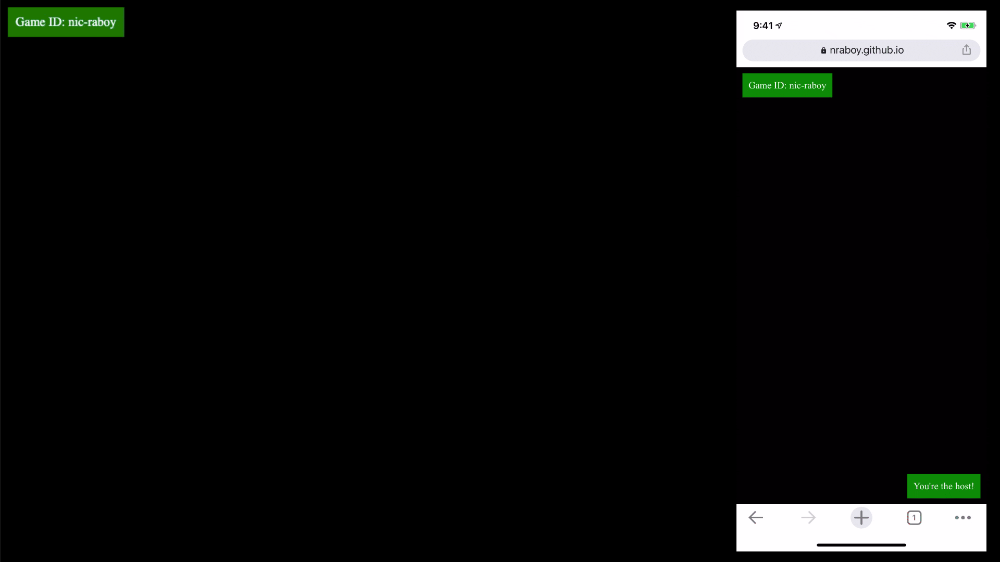

# Mongo Draws

This is an example project that leverages MongoDB Atlas, MongoDB Stitch, and the Phaser gaming framework. The idea is to be a drawing game where brush strokes are stored to MongoDB and synchronize to all the connected clients in near real-time for an interactive gaming experience.



## Configuring the Project

To use your own instance of MongoDB, some values must be changed within the **index.html** file. Open the file and search for the following:

```javascript
const game = new Game({
    "id": "game",
    "width": 800,
    "height": 400,
    "stitchAppId": "mongo-draws-zxpwa",
    "databaseName": "mongo-draws",
    "collectionName": "game"
});
```

Make sure to change the `stitchAppId`, `databaseName` and `collectionName` information with that of your own prior to trying to use the application.

## Running the Game

Phaser does not allow projects to be ran from the local filesystem. Instead, the project must be served and accessible over HTTP. There are plenty of options that will serve HTML files, but popular ones include Python or the NPM [serve](https://www.npmjs.com/package/serve) package.