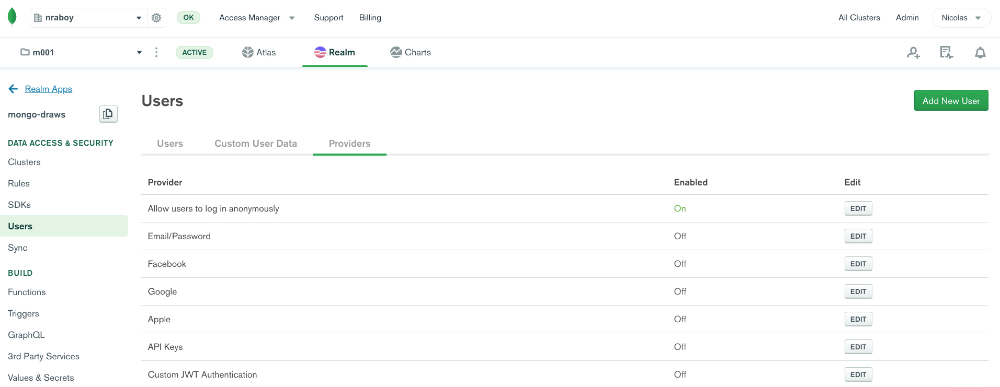
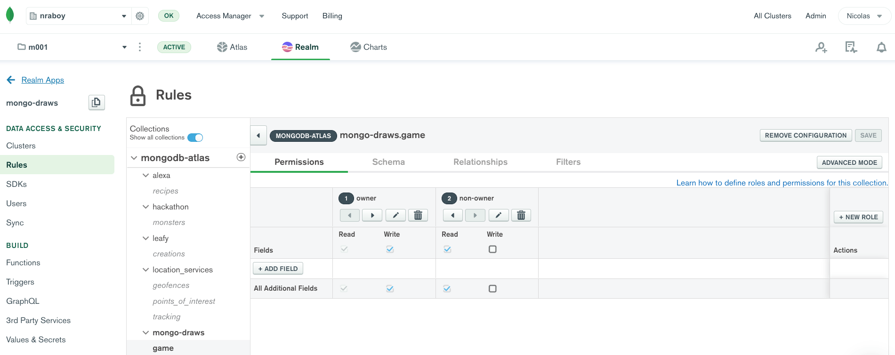

# Creating a Multiplayer Drawing Game with Phaser and MongoDB

When it comes to MongoDB, an often overlooked industry that it works amazingly well in is gaming. It works great in gaming because of its performance, but more importantly its ability to store whatever complex data the game throws at it.

Let's say you wanted to create a drawing game like [Pictionary](https://en.wikipedia.org/wiki/Pictionary). I know what you're thinking, why would I ever want to create a Pictionary game with MongoDB integration. Well what if you wanted to be able to play with friends remotely? In this scenario, you could store your brush strokes in MongoDB and load those brush strokes on your friends device. These brush strokes can be pretty much anything. They could be images, vector data, or something else entirely.

A drawing game is just one of many possible games that would pair well with MongoDB.

In this tutorial, we're going to create a drawing game using [Phaser](https://phaser.io/). The data will be stored and synced with MongoDB and be visible on everyone elses device, whether that be computer or mobile.

Take the following animated image for example:


In the above example, I have my iOS device as well as my MacBook in the display. I'm drawing on my iOS device and after the brush strokes are considered complete, they are sent to MongoDB and the other clients watch for that incoming data. This is why the strokes are not instantly available as the strokes are in progress.

## The Tutorial Requirements

There are a few requirements that must be met prior to starting this tutorial:

- A MongoDB Atlas free tier cluster or better must be available.
- A MongoDB Realm application configured to use the Atlas cluster.

The heavy lifting of this example will be with [Phaser](https://phaser.io/), [MongoDB Atlas](https://www.mongodb.com/cloud/atlas), and [MongoDB Realm](https://www.mongodb.com/realm).

> MongoDB Atlas has a forever FREE tier that can be configured in the [MongoDB Cloud](https://cloud.mongodb.com).

There's no account requirement when it comes to building Phaser games. These games are both web and mobile compatible.

## Drawing with Phaser, HTML, and Simple JavaScript

When it comes to Phaser, you can do everything within a single HTML file. This file must be served rather than opened from the local filesystem, but nothing extravagant needs to be done with the project.

Let's start by creating a project somewhere on your computer with an **index.html** file and a **game.js** file. We're going to add some boilerplate code to our **index.html** prior to adding our game logic to the **game.js** file.

Within the **index.html** file, add the following:

```auto
<!DOCTYPE html>
<html>
    <head>
        <meta http-equiv="X-UA-Compatible" content="chrome=1, IE=9">
        <meta name="viewport" content="initial-scale=1 maximum-scale=1 user-scalable=0 minimal-ui shrink-to-fit=no" />        
        <script src="https://cdn.jsdelivr.net/npm/phaser@3.15.1/dist/phaser-arcade-physics.min.js"></script>
        <script src="https://s3.amazonaws.com/stitch-sdks/js/bundles/4.6.0/stitch.js"></script>
        <script src="./game.js"></script>
    </head>
    <body style="margin: 0">
        <div id="game" style="margin: 0; padding: 0"></div>
        <script>
            // Logic in here ...
        </script>
    </body>
</html>
```

In the above HTML, we've added both Phaser and MongoDB. We've also defined an HTML container element, as seen by the `game` id, to hold our game when the time comes.

We could add all of our Phaser and MongoDB logic into the unused `<script>` tag, but this is where it makes sense to have most of our logic in the **game.js** file.

Open the **game.js** file and include the following boilerplate code:

```javascript
class Game {

    constructor(config = {}) {
        this.phaserConfig = {
            type: Phaser.AUTO,
            parent: config.id ? config.id : "game",
            width: config.width ? config.width : 800,
            height: config.height ? config.height : 600,
            scene: {
                key: "default",
                init: this.initScene,
                create: this.createScene,
                update: this.updateScene
            }
        };
    }

    async initScene(data) { }
    async createScene() { }
    async updateScene() { }

    async authenticate() { }
    async joinOrCreateGame(id) { }
    async joinGame(id, authId) { }
    async createGame(id, authId) { }

}
```

The above `Game` class is responsible for rendering and interactions between the user and the game as well as the interactions between the game and the database. For now, we're not going to worry about our database.

Within the `constructor` method, we take information provided from the user to configure Phaser. Some of the configuration fields have default values in case the user decides not to provide them when instantiating the class. When it comes to the scenes, the `initScene` will be responsible for initializing our game variables, the `createScene` will be responsible for synchronizing with the server when the game first loads, and the `updateScene` will be responsible for ongoing interactions with the game.

Before we jump into each of the functions, let's go back into the **index.html** file and instantiate our class. This can be done in the `<script>` tag that currently exists:

```auto
<script>
    const game = new Game({
        "id": "game",
        "width": window.innerWidth,
        "height": window.innerHeight
    });
</script>
```

In the above code, we're defining that our game should be rendered in the HTML element with the `game` id. We're also saying that it should take the full width and height that's available to us in the browser. This full width and height works for both computers and mobile devices.

Now we can take a look at each of our scenes, starting with the `initScene` function:

```javascript
initScene(data) {
    this.strokes = [];
    this.isDrawing = false;
}
```

For now, the `initScene` function will remain short. This is because we are not going to worry about initializing any database information yet. When it comes to `strokes`, this will represent independent collections of points. A brush stroke is just a series of connected points, so we want to maintain them. We need to be able to determine when a stroke starts and finishes, so we can use `isDrawing` to determine if we've lifted our cursor or pencil.

Now let's have a look at the `createScene` function:

```javascript
async createScene() {
    this.graphics = this.add.graphics();
    this.graphics.lineStyle(4, 0x00aa00);
}
```

Like with the `initScene`, this function will change as we add the database functionality. For now, we're initializing the graphics layer in our scene and defining the line size and color that should be rendered. This is a simple game so all lines will be 4 pixels in size and the color green.

This brings us into the most extravagant of the scenes. Let's take a look at the `updateScene` function:

```javascript
updateScene() {
    if(!this.input.activePointer.isDown && this.isDrawing) {
        this.isDrawing = false;
    } else if(this.input.activePointer.isDown) {
        if(!this.isDrawing) {
            this.path = new Phaser.Curves.Path(this.input.activePointer.position.x - 2, this.input.activePointer.position.y - 2);
            this.isDrawing = true;
        } else {
            this.path.lineTo(this.input.activePointer.position.x - 2, this.input.activePointer.position.y - 2);
        }
        this.path.draw(this.graphics);
    }
}
```

The `updateScene` function is responsible for continuously rendering things to the screen. It is constantly ran, unlike the `createScene` which is only ran once. When updating, we want to check to see if we are either drawing or not drawing.

If the `activePointer` is not down, it means we are not drawing. If we are not drawing, we probably want to indicate so with the `isDrawing` variable. This condition will get more advanced when we start adding database logic.

If the `activePointer` is down, it means we are drawing. In Phaser, to draw a line, we need a starting point and then a series of points we can render as a path. If we're starting the brush stroke, we should probably create a new path. Because we set our line to be 4 pixels, if we want the line to draw at the center of our cursor, we need to use half the size for the x and y position.

We're not ever clearing the canvas, so we don't actually need to draw the path unless the pointer is active. When the pointer is active, whatever was previously drawn will stay on the screen. This is save us some processing resources.

We're almost at a point where we can test our offline game!

The scenes are good, even though we haven't added MongoDB logic to them. We need to actually create the game so the scenes can be used. Within the **game.js** file, add the following function:

```javascript
createGame() {
    this.game = new Phaser.Game(this.phaserConfig);
    this.game.scene.start("default", {});
}
```

The above code will take the Phaser configuration that we had set in the `constructor` method and start the `default` scene. As of right now we aren't passing any data to our scenes, but we will in the future.

With the `createGame` function available, we need to make use of it. Within the **index.html** file, add the following line to your `<script>` block:

```auto
game.createGame();
```

You did it! You have a game where you can draw lines. As of right now you can only ever have one game and the pictures you draw won't save or sync anywhere. We'll get to that next!

Just remember, if you want to try out your game, you need to serve it or host it. You cannot just open the **index.html** file from your filesystem.

## Configuring MongoDB Atlas and MongoDB Realm for Data Persistance and Sync

So what's the goal for the next step of this tutorial?

We are able to draw lines on the canvas. It works great, but we can only ever have a single game and if we refresh, those lines disappear. In addition, if we wanted a friend to see our image, they wouldn't be able to.

So we're going to do the following with MongoDB Atlas and MongoDB Realm:

- Create game room documents for a host that have path data.
- Watch for changes to a game room document and render them on the screen.

Rather than starting in our code, we're going to get things ready to go in Atlas and Realm first. We need to get a database and collection ready as well as the data rules for who can access and manipulate the data.

Assuming you've already created an Atlas cluster, create a `mongo-draws` database with a `game` collection. We're not going to add any documents manually, but when we start adding them, they're going to look like this:

```json
{
    "_id": "nraboy",
    "owner_id": "5ed66f8e2bfe8289db922d1f",
    "strokes": [
        {
            "type": "Path",
            "x": 96,
            "y": 200,
            "curves": [
                {
                    "type": "LineCurve",
                    "points": [
                        96,
                        200,
                        95,
                        201
                    ]
                }
            ]
        }
    ]
}
```

The `strokes` array will be populated from whatever Phaser determines to be a path, as created in the earlier part of this tutorial. The `_id` will represent a game room and the `owner_id` will represent the host or owner of that particular room. Essentially, the plan is to have only the host able to add new brush strokes in a game room while the other participants watch.

Before we start creating the data access rules, we want to figure out who can even participate. For the simplicity of this example, we won't worry about accounts, so [anonymous authentication](https://docs.mongodb.com/realm/authentication/anonymous/) will be all we need.



You can enable anonymous authentication by clicking the **Providers** tab in the **Users** area of the Realm dashboard.

With the anonymous authentication enabled, now we can define the read and write rules of our documents.



Within the **Rules** area of the Realm dashboard, you're going to want to create two rules for the **game** collection. The first rule, for the document owner, you'll want to give them read and write ability. For non-owners, since we want them to spectate the game, we will give them read access. During the process of creating rules, make sure to specify that the `owner_id` of the document is to be mapped to the document owner.

In theory, MongoDB Atlas and Realm are ready to be used in our game.

Open the project's **game.js** file and add the following to the `constructor` method:

```javascript
this.client = stitch.Stitch.initializeDefaultAppClient(config.realmAppId);
this.database = this.client.getServiceClient(stitch.RemoteMongoClient.factory, "mongodb-atlas").db(config.databaseName);
this.collection = this.database.collection(config.collectionName);
```

We want to configure how we plan to use MongoDB Realm when we instantiate our `Game` class. This means that we need to change what we're doing in the **index.html** file slightly:

```javascript
const game = new Game({
    "id": "game",
    "width": window.innerWidth,
    "height": window.innerHeight,
    "realmAppId": "REALM_APP_ID",
    "databaseName": "mongo-draws",
    "collectionName": "game"
});
```

You'll notice that we have three new configuration fields to be fed into our Realm configuration.

Before we try to create or join an existing game, we need to authenticate with MongoDB Realm. Within the **game.js** file, create the following function:

```javascript
async authenticate() {
    return this.client.auth.loginWithCredential(new stitch.AnonymousCredential());
}
```

Remember, we're doing anonymous authentication, so nothing too fancy. We're not going to try to authenticate with this function quite yet.

So now what we need to do is figure out how to either create a new game room document, or use one that already exists. We already have a `createGame` function, but we're going to need to improve upon it to include database functionality. Within the `createGame` function of the **game.js** file, change it to the following:

```javascript
async createGame(id, authId) {
    try {
        let game = await this.collection.insertOne({
            "_id": id,
            "owner_id": authId,
            "strokes": []
        });
        this.game = new Phaser.Game(this.phaserConfig);
        this.game.scene.start("default", {
            "gameId": id,
            "collection": this.collection,
            "authId": authId,
            "ownerId": authId,
            "strokes": []
        });
        return { "gameId": id, "authId": authId, "owner_id": authId };
    } catch (e) {
        console.error(e);
    }
}
```

Remember, previously we were just creating a game and starting the scene collection. Now we're creating a new document based on the passed game id and owner id, then passing some of that information to the scene itself.

So why are we passing this information?

Because of how JavaScript scopes variables, we don't have access to the class level variables from within our scenes. To get around this, we are passing those variables into the scene when we start the scene. Information that's important to the scene includes the owner id for the document so that we can figure out who should be able to draw, the collection information so we can access the data, the game id so we know which data to access, and then initial information for brush stroke data.

We could update the **index.html** file to use the new `createGame` function, but we know we're going to want to create or join, not just create. With this in mind, let's create another function in the **game.js** file:

```javascript
async joinGame(id, authId) {
    try {
        let result = await this.collection.findOne({ "_id": id });
        if(result != null) {
            this.game = new Phaser.Game(this.phaserConfig);
            this.game.scene.start("default", { 
                "gameId": id,
                "collection": this.collection,
                "authId": authId,
                "ownerId": result.owner_id,
                "strokes": result.strokes
            });
        }
        return result;
    } catch (e) {
        console.error(e);
    }
}
```

Rather than inserting a new document, we are trying to find one based on the game id that was provided. If no data comes back, it means no game exists. However, if a game does exist, we're going to initialize the game scene with the stored information.

With the `joinGame` and `createGame` functions available, let's create a wrapper function to eliminate some of the work.

```javascript
async joinOrCreateGame(id) {
    try {
        let auth = await game.authenticate();
        let result = await game.joinGame(id, auth.id);
        if (result == null) {
            result = await game.createGame(id, auth.id);
        }
        return result;
    } catch (e) {
        console.error(e);
    }
}
```

In the `joinOrCreateGame` function, we're first authenticating with MongoDB Realm. Once we've authenticated, we attempt to join a game. If the join is not successful because no document exists, then we try to create a game.

So let's update the **index.html** file to use our `joinOrCreateGame` function instead of our `createGame` function:

```javascript
let result = await game.joinOrCreateGame("nraboy");
```

Since we're working with game documents, let's update that `initScene` function. The one where we are passing game information to when we do a create or a join:

```javascript
initScene(data) {
    this.collection = data.collection;
    this.authId = data.authId;
    this.gameId = data.gameId;
    this.ownerId = data.ownerId;
    this.strokes = data.strokes;
    this.isDrawing = false;
}
```

Alright, so we have a mechanism for creating and joining games. We can do better though. We probably don't want to hard-code the game id when trying to join or create a game. Let's add some more HTML elements to help us out.

Open the **index.html** file and make it look like the following:

```auto
<!DOCTYPE html>
<html>
    <head>
        <meta http-equiv="X-UA-Compatible" content="chrome=1, IE=9">
        <meta name="viewport" content="initial-scale=1 maximum-scale=1 user-scalable=0 minimal-ui shrink-to-fit=no" />        
        <script src="https://cdn.jsdelivr.net/npm/phaser@3.15.1/dist/phaser-arcade-physics.min.js"></script>
        <script src="https://s3.amazonaws.com/stitch-sdks/js/bundles/4.6.0/stitch.js"></script>
        <script src="./game.js"></script>
    </head>
    <body style="margin: 0">
        <div style="position: absolute; background-color: green; padding: 10px; margin: 10px; color: #FFFFFF">
            <div id="visitor">
                <input id="gameid" type="text" placeholder="Game ID" onkeypress="joinOrCreateGameKeyPress(event)" />
                <button id="creategame" type="button" onclick="joinOrCreateGame()">Create / Join</button>
            </div>
            <div id="information" style="display: none">
                Game ID: 
            </div>
        </div>
        <div id="ishost" style="position: absolute; background-color: green; color: #FFFFFF; padding: 10px; bottom: 10px; right: 10px;">
            Not in a game...
        </div>
        <div id="game" style="margin: 0; padding: 0"></div>
        <script>
            const game = new Game({
                "id": "game",
                "width": window.innerWidth,
                "height": window.innerHeight,
                "realmAppId": "REALM_APP_ID",
                "databaseName": "mongo-draws",
                "collectionName": "game"
            });

            async function joinOrCreateGame() {
                if(!document.getElementById("gameid").value || document.getElementById("gameid").value == "") {
                    return alert("The Game ID Must Not Be Empty");
                }
                try {
                    let result = await game.joinOrCreateGame(document.getElementById("gameid").value);
                    document.getElementById("ishost").innerHTML = result.authId == result.owner_id ? "You're the host!" : "You are not the host!";
                    document.getElementById("visitor").style.display = "none";
                    document.getElementById("information").innerHTML = "Game ID: " + document.getElementById("gameid").value;
                    document.getElementById("information").style.display = "block";
                } catch (e) {
                    console.error(e);
                }
            }

            function joinOrCreateGameKeyPress(event) {
                if(event.keyCode == 13) {
                    joinOrCreateGame();
                    return false;
                }
            }
        </script>
    </body>
</html>
```

The above code has a little more going on now. You'll start by probably noticing the following markup:

```auto
<div style="position: absolute; background-color: green; padding: 10px; margin: 10px; color: #FFFFFF">
    <div id="visitor">
        <input id="gameid" type="text" placeholder="Game ID" onkeypress="joinOrCreateGameKeyPress(event)" />
        <button id="creategame" type="button" onclick="joinOrCreateGame()">Create / Join</button>
    </div>
    <div id="information" style="display: none">
        Game ID: 
    </div>
</div>
<div id="ishost" style="position: absolute; background-color: green; color: #FFFFFF; padding: 10px; bottom: 10px; right: 10px;">
    Not in a game...
</div>
<div id="game" style="margin: 0; padding: 0"></div>
```

Not all of it was absolutely necessary, but it does give our game a better look and feel. Essentially now we have an input field. When the input field is submitted, whether that be with keypress or click, the `joinOrCreateGame` function is called. The function isn't called directly, but the wrapper functions call it. The game id is extracted from the input, and the HTML components are transformed based on the information about the game.

To summarize what happens, the user submits a game id. The game id floats on top of the game scene as well as information regarding if you're the owner of the game or not.

The markup looks worse than it is.

Now that we can create or join games both from a UX perspective and a logic perspective, we need to change what happens when it comes to interacting with the game itself. We need to be able to store our brush strokes in MongoDB. To do this, we're going to revisit the `updateScene` function:

```javascript
updateScene() {
    if(this.authId == this.ownerId) {
        if(!this.input.activePointer.isDown && this.isDrawing) {
            this.collection.updateOne(
                { 
                    "owner_id": this.authId,
                    "_id": this.gameId
                },
                {
                    "$push": {
                        "strokes": this.path.toJSON()
                    }
                }
            ).then(result => console.log(result));
            this.isDrawing = false;
        } else if(this.input.activePointer.isDown) {
            if(!this.isDrawing) {
                this.path = new Phaser.Curves.Path(this.input.activePointer.position.x - 2, this.input.activePointer.position.y - 2);
                this.isDrawing = true;
            } else {
                this.path.lineTo(this.input.activePointer.position.x - 2, this.input.activePointer.position.y - 2);
            }
            this.path.draw(this.graphics);
        }
    }
}
```

Remember, this time around we have access to the game id and the owner id information. It was passed into the scene when we created or joined a game.

When it comes to actually drawing, nothing is going to change. However, when we are considered not drawing, we want to update the game document to push our new strokes. Phaser makes it easy to convert our line information to JSON which inserts very easily into MongoDB. Remember earlier when I said accepting flexible data was a huge benefit for gaming?

So we are pushing these brush strokes to MongoDB. We need to be able to load them from MongoDB.

Let's have a look at our `createScene` function:

```javascript
async createScene() {
    this.graphics = this.add.graphics();
    this.graphics.lineStyle(4, 0x00aa00);
    this.strokes.forEach(stroke => {
        this.path = new Phaser.Curves.Path();
        this.path.fromJSON(stroke);
        this.path.draw(this.graphics);
    });
}
```

When the `createScene` function executes, we are taking the `strokes` array that was provided by the `createGame` and `joinGame` functions and looping over it. Remember, in the `updateScene` function we are storing the exact path. This means we can load the exact path and draw it.

This is great, but the users on the other end will only see the brush strokes when they first launch the game. We need to make it so they get new brush strokes as they are pushed into our document. We can do this with change streams in Realm.

Let's update our `createScene` function once more:

```javascript
async createScene() {
    this.graphics = this.add.graphics();
    this.graphics.lineStyle(4, 0x00aa00);
    this.strokes.forEach(stroke => {
        this.path = new Phaser.Curves.Path();
        this.path.fromJSON(stroke);
        this.path.draw(this.graphics);
    });
    const stream = await this.collection.watch({ "fullDocument._id": this.gameId });
    stream.onNext(event => {
        let updatedFields = event.updateDescription.updatedFields;
        if(updatedFields.hasOwnProperty("strokes")) {
            updatedFields = [updatedFields.strokes["0"]];
        }
        for(let strokeNumber in updatedFields) {
            let changeStreamPath = new Phaser.Curves.Path();
            changeStreamPath.fromJSON(updatedFields[strokeNumber]);
            changeStreamPath.draw(this.graphics);
        }
    });
}
```

We're now watching our collection for documents that have an `_id` field that match our game id. Remember, we're in a game, we don't need to watch documents that are not our game. When a new document comes in, we can look at the updated fields and render the new strokes to the scene.

So why are we not using `path` like all the other areas of the code?

You don't know when new strokes are going to come in. If you're using the same global variable between the active drawing canvas and the change stream, there's a potential for the strokes to merge together given certain race conditions. It's just easier to let the change stream make its own path.

At this point in time, assuming your cluster is available and the configurations were made correct, any drawing you do will be added to MongoDB and essentially synchronized to other computers and devices watching the document.

## Conclusion

You just saw how to make a simple drawing game with Phaser and MongoDB. Given the nature of Phaser, this game is compatible on computers as well as mobile devices, and given the nature of MongoDB and Realm, anything you add to the game will potentially sync across devices and platforms as well.

This is just one of many possible gaming examples that could use MongoDB, and it doesn't even truly need to be a game. You could be creating the next Photoshop application and you want every brush stroke, every layer, etc., to be synchronized to MongoDB. What you can do is limitless.